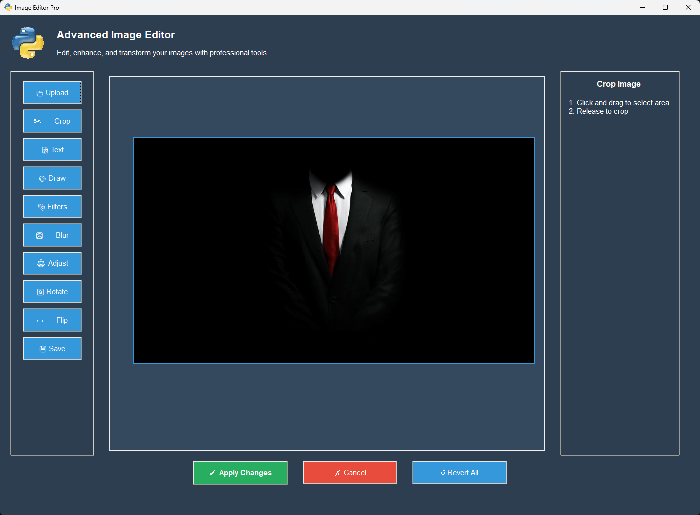

# Image Editor Pro 🎨



A professional-grade image editing application built with Python, offering a comprehensive suite of editing tools with an intuitive interface. This project demonstrates modern Python programming practices, including modular design, type safety, and comprehensive documentation.

## ✨ Features

- 📸 Basic Image Operations
  - Open and save images in various formats (JPG, PNG, BMP, GIF)
  - Crop with interactive selection
  - Rotate and flip transformations
  - Undo/Redo functionality

- 🎨 Advanced Editing Tools
  - Freehand drawing with customizable colors
  - Text overlay with color selection
  - Multiple blur effects (Average, Gaussian, Median)
  - Brightness and saturation adjustments

- 🎭 Filters and Effects
  - Black & White conversion
  - Negative effect
  - Sepia tone
  - Emboss effect
  - Sketch effect
  - Binary threshold
  - Erosion and dilation
  - Stylization

- 💻 Modern UI Features
  - Dark theme interface
  - Real-time preview
  - Intuitive tool organization
  - Responsive canvas
  - Progress feedback

## 🚀 Installation

1. Clone the repository:
```bash
git clone https://github.com/pouryare/image_editor.git
cd image_editor
```

2. Create a virtual environment (recommended):
```bash
python -m venv venv
source venv/bin/activate  # On Windows: venv\Scripts\activate
```

3. Install required packages:
```bash
pip install -r requirements.txt
```

### 📦 Required Libraries

```txt
opencv-python
numpy
Pillow
tk
```

## 🎮 Usage

Run the application:
```bash
python main.py
```

## 🏗️ Project Structure

The project follows a modular architecture for maintainability and clarity:

```
image_editor/
├── main.py               # Application entry point
├── image_editor.py       # Core ImageEditor class
├── gui_setup.py          # GUI initialization and setup
├── drawing_tools.py      # Drawing functionality
├── crop_tools.py         # Image cropping tools
├── filter_tools.py       # Image filters and effects
├── blur_tools.py         # Blur operations
├── adjust_tools.py       # Image adjustments
├── transform_tools.py    # Rotation and flip operations
├── text_tools.py         # Text overlay tools
├── file_operations.py    # File handling
├── image_utils.py        # Image processing utilities
├── action_handlers.py    # Action management
├── constants.py          # Configuration and constants
├── types.py              # Type definitions
├── python_logo.gif       # Application icon
└── screenshot.png        # Application screenshot
```

Each module is carefully designed with specific responsibilities:

| Module | Description |
|--------|-------------|
| `main.py` | Application entry point and initialization |
| `image_editor.py` | Core class coordinating all functionality |
| `gui_setup.py` | GUI layout and styling management |
| `drawing_tools.py` | Freehand drawing implementation |
| `crop_tools.py` | Interactive cropping functionality |
| `filter_tools.py` | Image filter implementations |
| `blur_tools.py` | Various blur effect implementations |
| `adjust_tools.py` | Image adjustment controls |
| `transform_tools.py` | Image transformation operations |
| `text_tools.py` | Text overlay functionality |
| `file_operations.py` | File handling operations |
| `image_utils.py` | Image processing utilities |
| `action_handlers.py` | Action management system |
| `constants.py` | Application constants |
| `types.py` | Type definitions and hints |

## 🤝 Contributing

Contributions are welcome! Please feel free to submit a Pull Request. For major changes, please open an issue first to discuss what you would like to change.

## 📝 License

This project is licensed under the MIT License - see the [LICENSE](LICENSE) file for details.

## 🙏 Acknowledgments

This project is inspired by various image editing applications and tutorials, including:
- OpenCV's Python tutorials
- Various tkinter-based image editors on GitHub
- Python image processing community projects

Special thanks to all the open-source contributors whose work has influenced this project.

## 👤 Author

**Pouryare**
* Github: [@pouryare](https://github.com/pouryare)

## 🌟 Show your support

Give a ⭐️ if this project helped you!

---

> Note: This application is a demonstration of Python programming concepts and image processing techniques. It's designed for educational purposes and as a starting point for more complex image editing applications.
